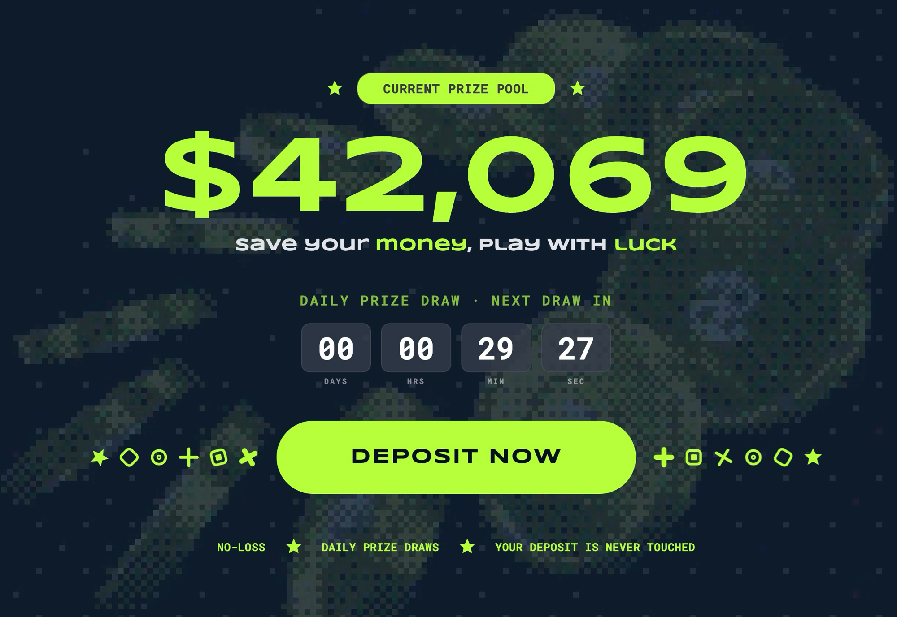
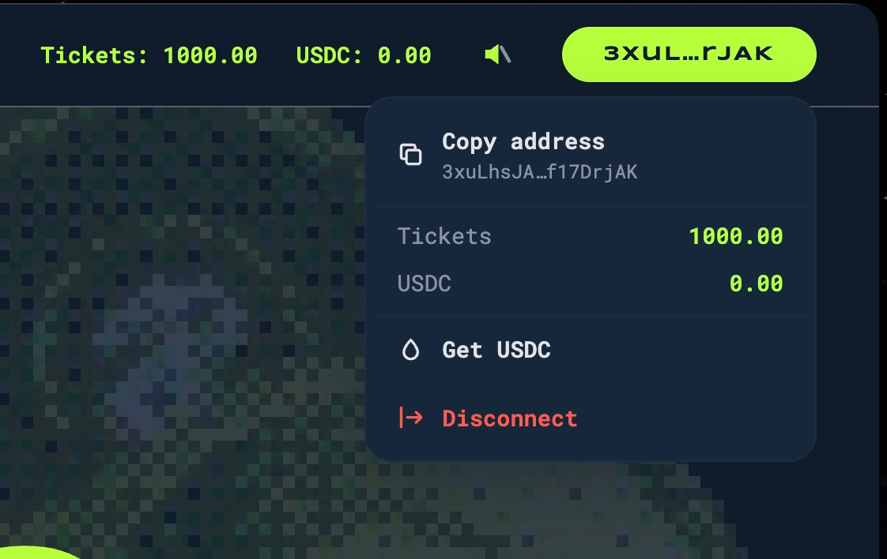
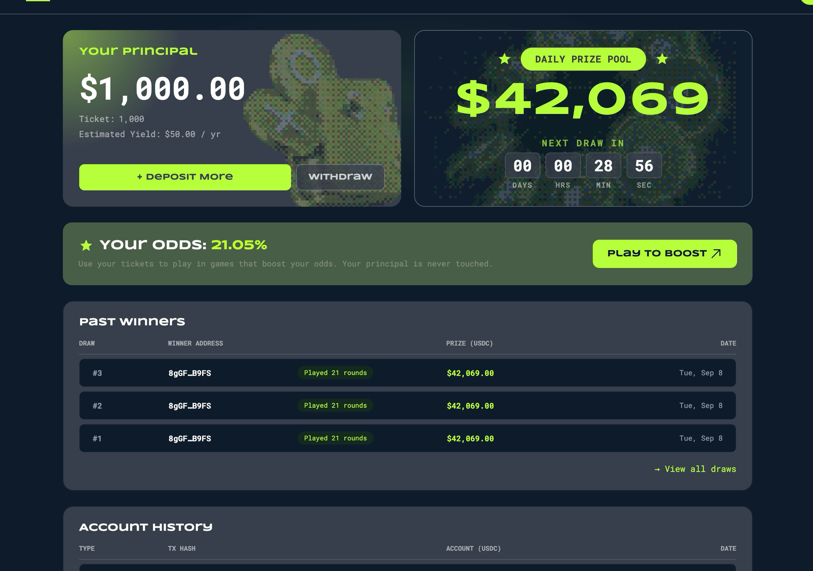
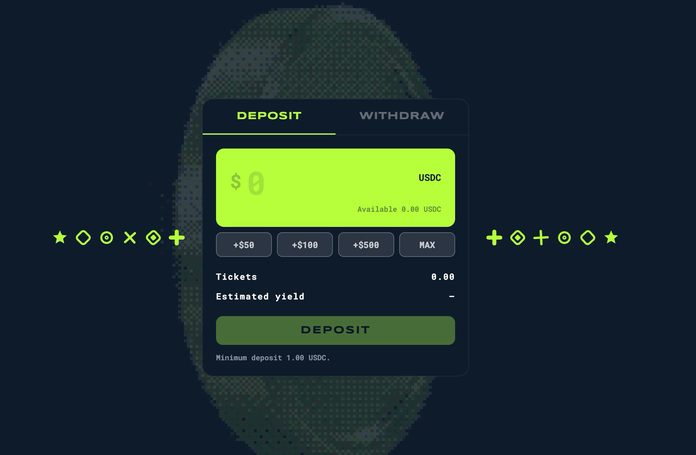
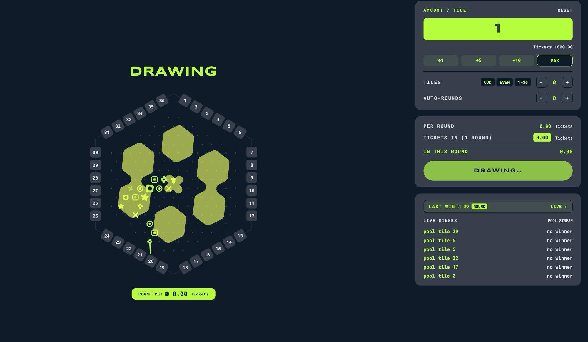

# HexVault

A no-loss lottery on Solana with a game bolted on. Deposit USDC, keep your principal, and
your time-weighted Entries are your odds in the draw for the pool's prize. Between draws, put
Entries on a 36-tile hex board and take the round pot from the other players when your tile
is drawn. Principal never moves except back to you.

The code, the API and this file say **Entries**; the screens currently say **Tickets**. Same
thing. [`CONTEXT.md`](CONTEXT.md) is the arbiter and it says Entries, so the UI is the side
that is wrong.

> Devnet prototype. Test assets only. No audit, no legal review, do not deposit real assets.



## Try it

- App: <https://hexofun-beta.vercel.app>
- API: <https://api-hexo.elvtd.io> (`/status` shows whether the operator is cranking)
- Program: `LFk9ba6QXuM9oYRRNGGPxMGzfo13X3DAr8ghSPz72C6` on devnet

Three steps to a position on the board:

1. **Connect.** Privy is the primary path, so an email or social login gets you an embedded
   wallet with sponsored gas. An external wallet (Phantom, Solflare) works too, but set it to
   devnet and fund it with SOL yourself: `solana airdrop 2 <address> --url devnet`.
2. **Get hexUSDC.** Open the wallet pill in the top right and hit **Get USDC**. The backend
   mints 1000 hexUSDC straight to your associated token account. One grant per wallet per
   hour; the button counts the cooldown down in place. hexUSDC is a test mint the bootstrap
   created, worth nothing.
3. **Deposit, then play.** EARN → Deposit credits equal Principal and Entries, minimum
   1 hexUSDC. PLAY puts those Entries on the board.

### Faucet



That dropdown button is the only faucet UI, but the route behind it is plain HTTP:

```
curl -X POST https://api-hexo.elvtd.io/faucet \
  -H 'content-type: application/json' \
  -d '{"owner":"<your wallet address>"}'
```

It answers `429` with a `retryAfterSeconds` while the wallet is still in cooldown. Grant size
and cooldown are `FAUCET_AMOUNT` and `FAUCET_INTERVAL_SECONDS` on the backend. This is the one
write route in the API: the operator's authority is also the hexUSDC mint authority.

Devnet SOL for gas is a separate problem. The faucet mints hexUSDC only.

## Pages

Every screen is one tab of a single-page app, reachable by URL hash. Only EARN and PLAY show
in the navbar; the rest are routable and linked from inside the app.

| Tab | Link | What it is |
| --- | --- | --- |
| HOME | [`/`](https://hexofun-beta.vercel.app/) | The landing frame. Today's prize as a whole-dollar hero, a countdown to the draw, one button into the vault. |
| EARN | [`/#earn`](https://hexofun-beta.vercel.app/#earn) | The dashboard. Your principal, this epoch's prize and draw clock, your odds, past winners, your own history. Where EARN lands. |
| VAULT | [`/#deposit`](https://hexofun-beta.vercel.app/#deposit) | The deposit widget, one hop in from the dashboard's Deposit / Withdraw buttons. Principal and Entries move together, so a withdrawal needs both. |
| PLAY | [`/#play`](https://hexofun-beta.vercel.app/#play) | The 36-tile hex board plus the control panel. Stake Entries on tiles (ODD / EVEN / 1-36 cover the board in one click), the round closes, ORAO's VRF picks the tile, the pot goes to whoever covered it. Auto-rounds repeats the same bet. |
| DAILY DRAW | [`/#draw`](https://hexofun-beta.vercel.app/#draw) | The epoch draw: prize, your Weight and odds, past winners. Sends `register` as the permissionless fallback if the operator has not cranked it. |
| LEADERBOARD | [`/#ranks`](https://hexofun-beta.vercel.app/#ranks) | Top ten players by Weight in the current epoch, straight from `GET /leaderboard`. Read-only. |
| ABOUT | [`/#about`](https://hexofun-beta.vercel.app/#about) | What this is and what can go wrong, stated plainly. |

### EARN

Your principal and Entries on the left, the epoch prize and its countdown on the right, then
your odds, past winners and your own account history.



### VAULT



### PLAY

Stakes go on tiles while the round is open. At `close_buffer` seconds before the end,
positions close, the operator requests randomness and the stage reads DRAWING until ORAO
answers, so a slow draw shows as a longer DRAWING rather than a timer stuck at zero.



## Read first

- [`CONTEXT.md`](CONTEXT.md): the vocabulary. Use these words and no others.
- [`runbook.md`](runbook.md): running it locally, redeploying, and what breaks.
- [`docs/product-requirements.md`](docs/product-requirements.md): what the product does.
- [`docs/plan/rebuild/spec.md`](docs/plan/rebuild/spec.md): program, backend, frontend, infra.
- [`docs/plan/rebuild/issues/`](docs/plan/rebuild/issues/): the ordered build tickets.
- [`docs/adr/`](docs/adr/): why the surprising choices were made.

## Run it locally

```bash
docker compose -f docker-compose.yml -f docker-compose.local.yml up -d   # postgres + backend
pnpm --filter @hexvault/web dev                                          # frontend
```

Then <http://localhost:5173>, wallet on devnet. [`runbook.md`](runbook.md) covers the rest:
what to rebuild after each kind of change, the `close_buffer` draw window, and the gotchas
that have already bitten (never build with `--features test-vrf` before a devnet deploy).

## Layout

```
programs/hex_vault/   Anchor program
apps/web/             Vite React frontend (Vercel)
apps/backend/         NestJS + Prisma: indexer, operator, read API (Contabo, docker compose)
tests/                Anchor localnet suite (test-vrf feature)
```

## Agent conventions

See [`AGENTS.md`](AGENTS.md) and `docs/agents/`.
