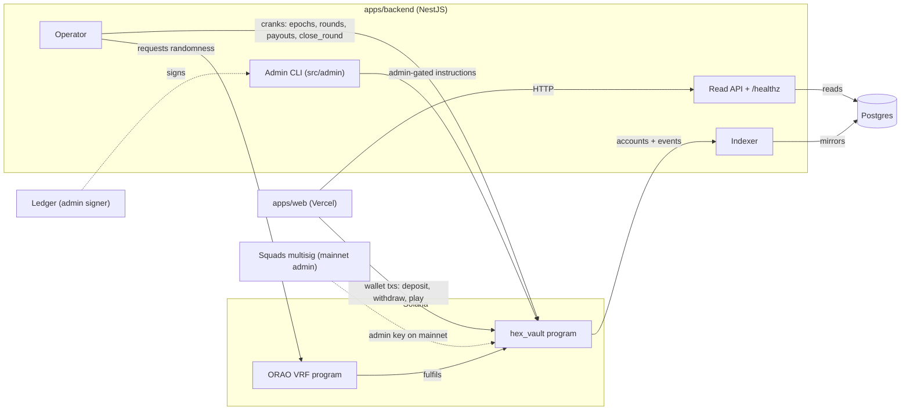
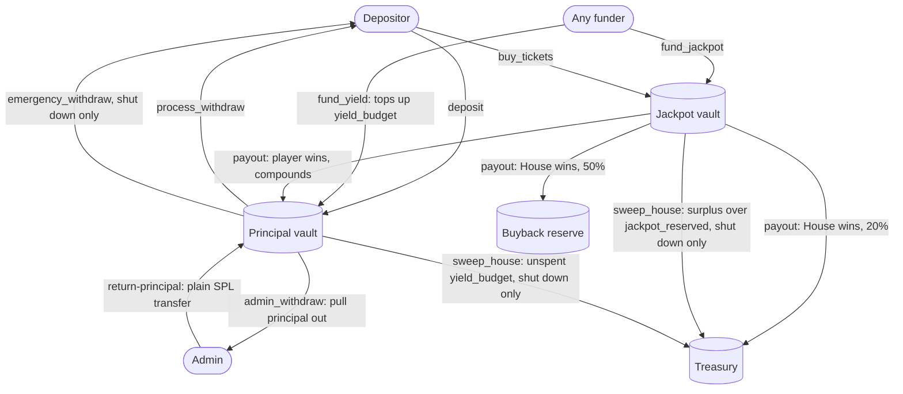
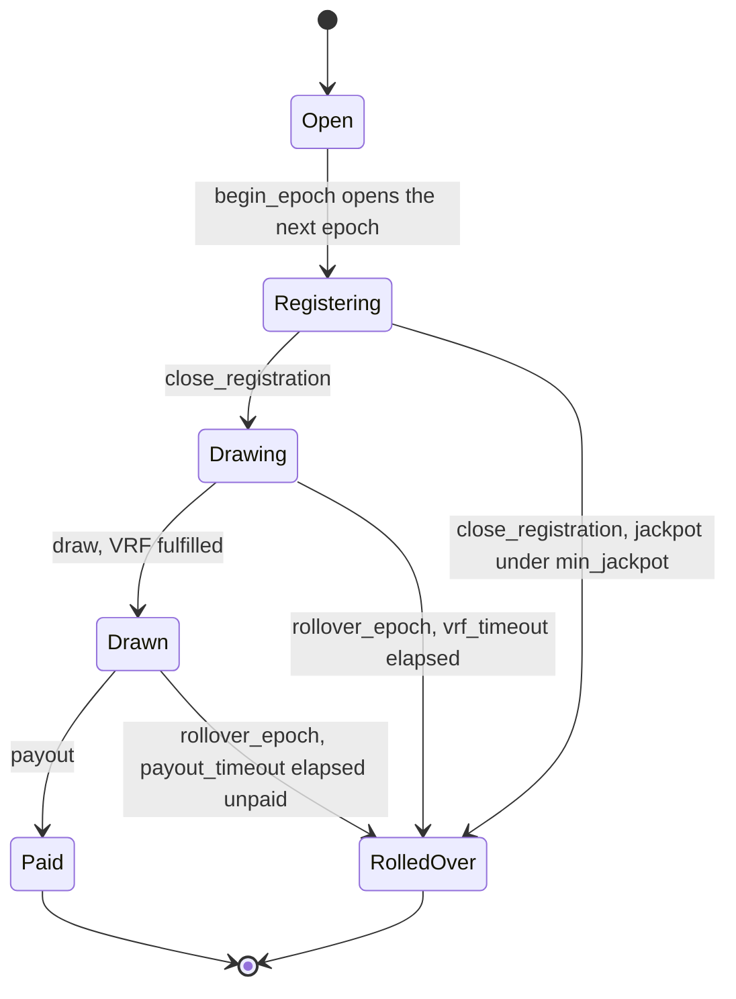
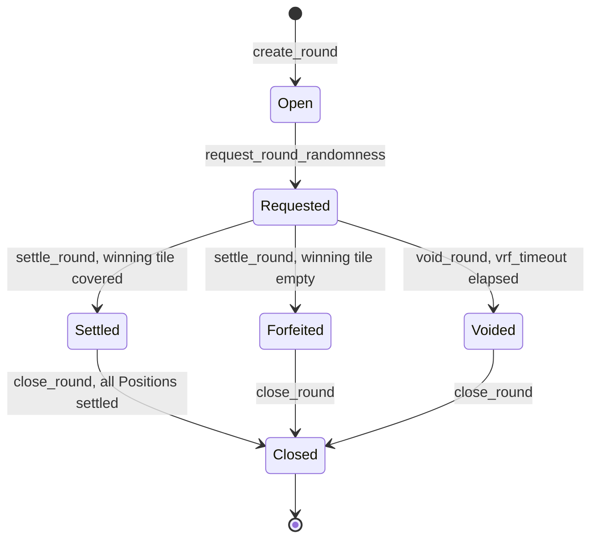

# Architecture

HexVault is one Anchor program (`hex_vault`), a NestJS backend that cranks it and mirrors it
into Postgres, and a Vite/React frontend that only ever reads from the backend. See
[`CONTEXT.md`](../CONTEXT.md) for vocabulary and [`docs/adr/`](adr/) for why things are shaped
this way.

## Components

The operator's hot key also owns the House `Player`. The admin key (a Squads multisig on
mainnet, a Ledger locally) never runs on the backend box.

## Accounts and PDAs

All seeds are declared in `programs/hex_vault/src/constants.rs`. `pool_id`, `epoch_id` and
`round_id` are little-endian `u64` bytes.

| Account | Seeds | Created by |
| --- | --- | --- |
| `Pool` | `["pool", pool_id]` | `create_pool` |
| Principal vault (token account) | `["principal", pool]` | `create_pool` |
| Jackpot vault (token account) | `["jackpot", pool]` | `create_pool` |
| `Player` (including the House) | `["player", pool, owner]` | `deposit` (`init_if_needed`); the House's own `Player` is created by `create_pool` with `params.operator` as `owner` |
| `Epoch` | `["epoch", pool, epoch_id]` | `begin_epoch` |
| `Round` | `["round", pool, round_id]` | `create_round` |
| `Position` | `["position", round, owner]` | `buy_position` |

`treasury` and `buyback_reserve` are plain token accounts passed into `create_pool`, not PDAs.
On mainnet they are the admin multisig's own associated token accounts.

`Pool`, `Epoch` and `Player` each carry a `version: u8` and a `_reserved` byte array so a future
field can land without changing any account's size (ADR 0013). `Round` and `Position` have no
padding: they are short-lived and reclaimed by `close_round` / `settle_position`.

## Roles

Signer is the account named `Signer<'info>` in the instruction's `Accounts` struct. "Anyone"
means the instruction takes no signer for that role at all: the outcome is pinned to a specific
account by seeds or an `address` constraint, so nobody can steer it by simply being the one who
sends the transaction.

| Instruction | Who signs | Notes |
| --- | --- | --- |
| `create_pool` | payer | Bootstrap only, one time per pool |
| `set_params` | admin | |
| `set_pause(true)` | admin or operator | |
| `set_pause(false)` | admin only | Refused while shut down |
| `shutdown` | admin | Irreversible |
| `set_operator` | admin | |
| `propose_admin` | admin | |
| `accept_admin` | the proposed `pending_admin` | Two-step handover |
| `deposit` | owner | |
| `request_withdraw` | owner | |
| `process_withdraw` | anyone | Destination is pinned to `player.owner` |
| `admin_withdraw` | admin | Destination is pinned to the admin's own ATA |
| `emergency_withdraw` | anyone | Only valid while shut down; destination pinned to `player.owner`; House excluded |
| `sweep_house` | admin | Only valid while shut down |
| `buy_tickets` | owner | |
| `grant_tickets` | admin or operator | Operator path is capped; admin path is not |
| `begin_epoch` | operator | |
| `register` | anyone | |
| `fund_jackpot` | anyone (source authority) | Permissionless top-up |
| `fund_yield` | anyone (source authority) | Permissionless top-up |
| `close_registration` | operator | |
| `draw` | operator | |
| `payout` | anyone | Winner and destination are both fixed on chain |
| `rollover_epoch` | operator | |
| `create_round` | operator | |
| `buy_position` | owner | |
| `request_round_randomness` | anyone (pays the ORAO fee) | |
| `settle_round` | operator | |
| `settle_position` | anyone | Rent returns to the Position's own owner |
| `void_round` | operator | |
| `close_round` | anyone | Rent returns to `pool.operator`; refuses while any Position is open |

## Fund flow

Base yield never moves USDC: `register` credits `yield_budget` straight into a player's
`principal` inside the vault, so the credit is an accounting entry against money already there.
A House win keeps 30% of the jackpot in the vault for the next epoch; that is why `sweep_house`
sweeps `jackpot_vault.amount - pool.jackpot_reserved`, never the raw balance (see the finding in
`docs/plan/ops-and-envs/issues/16-security-review-before-mainnet.md`, and ADR 0013 for the
upgrade that carried the fix).

## Epoch lifecycle

`payout` is refused for anything but a `Drawn` epoch. `shutdown` refuses `close_registration` and
`begin_epoch` but not `draw`, so an epoch already `Drawing` when the pool shuts down can still be
drawn and paid (its randomness was requested before shutdown, and refusing the draw would leave
its `jackpot_reserved` locked for good); an epoch that had not closed registration yet never
draws, and an already `Drawn` one still pays.

## Round lifecycle

`settle_position` closes each `Position` and decrements `Round.open_positions`; `close_round`
refuses while that counter is nonzero, then closes the `Round` and returns its rent to
`pool.operator`.

## Backend jobs and the indexer read model

The operator (`apps/backend/src/operator`) is deadline-driven: it sleeps until the next moment a
decision could change, with a 60-second safety tick as a backstop. Each tick runs at most one
step:

1. Settle a `Round` whose randomness is due.
2. Sweep unsettled `Position`s on a terminal `Round`.
3. Close a terminal `Round` once nothing settled on it is still owed (`close_round`).
4. `begin_epoch`, once the round and sweep steps above are clear.
5. Grant the daily referral bonus, once per epoch.
6. Register the ended epoch's players and credit Base yield.
7. Request or await the epoch's draw randomness.
8. `payout` the winner.
9. Pay out matured withdrawal requests (`process_withdraw`), batched.
10. Open the next `Round`, if a whole one still fits before the epoch ends.

Steps 4 through 6 and 10 stop once `pool.shutdown` is true, mirroring which instructions the
program itself refuses (`begin_epoch`, `close_registration`, `create_round`, and every inflow:
`deposit`, `buy_tickets`, `grant_tickets`, `fund_yield`, `buy_position`, `admin_withdraw`,
`set_pause(false)`). Steps 1 through 3, 7, 8 and 9 keep running: settling, closing and sweeping
an already-open `Round`, `draw` of an epoch already `Drawing` (or its `rollover_epoch` on
timeout), `payout` of an epoch already `Drawn`, and matured withdrawals are all still allowed post-shutdown
(`docs/ops/funds.md` covers what to do about the ones that were not). Every operator transaction
carries a priority fee: the 75th percentile of `getRecentPrioritizationFees` over the
transaction's writable accounts, capped at `PRIORITY_FEE_MAX_MICROLAMPORTS` (default 50,000).

The indexer (`apps/backend/src/indexer`) mirrors `Pool`, `Epoch`, `Round`, `Player` and
`Position` accounts plus finalized events into Postgres (ADR 0008); it is the only read path the
browser has; there is no chain fallback. A `Round` row keeps its last mirrored state after
`close_round` closes the account on chain instead of being deleted. The indexer also tracks
invite codes and redemptions, referral qualification, faucet claims and its own cursor. It
indexes `Pool.shutdown` and `Pool.version`, and the `PoolShutdown`, `EmergencyWithdrawn`,
`HouseSwept` and `RoundClosed` events.

`GET /status` reports `shutdown` and `principalOut` (`total_principal + pending_withdrawals +
yield_budget - vault.amount`, floored at 0). `GET /healthz` reports the operator's SOL balance
and turns `degraded` below `OPERATOR_SOL_WARN` (default 0.5 SOL).

See [`docs/ops/deploy.md`](ops/deploy.md), [`docs/ops/funds.md`](ops/funds.md) and
[`docs/ops/environments.md`](ops/environments.md) for running and operating this.
